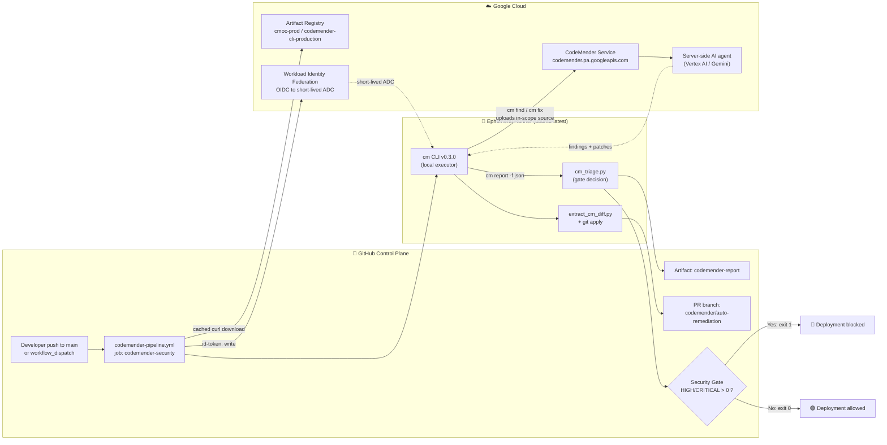
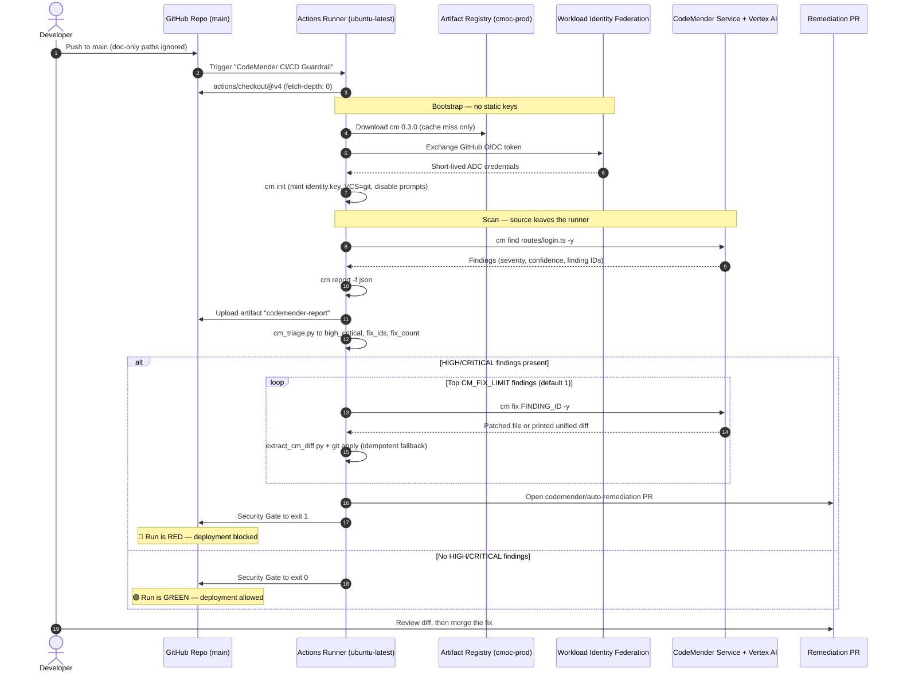

# Module 2 Lab — CodeMender CI/CD Guardrail

Build an **autonomous security guardrail** into a CI/CD pipeline. When code is
pushed, Google **CodeMender** (the `cm` CLI) scans it, blocks the deployment if
it finds a HIGH/CRITICAL vulnerability, publishes a machine-readable report, and
opens a pull request that **patches the bug automatically**.

Your target application is **OWASP Juice Shop** — a deliberately vulnerable
web app. CodeMender will surface several HIGH/CRITICAL bugs in `routes/` (SQL
injection, file-upload XXE / Zip-Slip, …) and auto-patch the most severe ones.

---

## What you'll learn

- How an AI security agent (CodeMender) is wired into GitHub Actions as a
  **deployment gate**.
- The real CodeMender pipeline: `find` (scan) → `report` → `fix` (auto-patch).
- Provisioning and using **CI secrets** safely.
- **Fail-safe gating**: turning a scan result into a red/green deploy decision.
- **Autonomous remediation**: an agent opening a PR with a code fix.

## How CodeMender actually works (read this first)

CodeMender is a **cloud service with a local executor**, not an on-device
scanner. The `cm` binary is a thin client: when you run `cm find`, it **uploads
your in-scope source** to `codemender.pa.googleapis.com`, where a server-side AI
agent reasons about vulnerabilities and drives the patch. Practically:

- **Your code leaves the machine.** Only point `cm` at code you're allowed to
  share. (Juice Shop is open source, so we're fine.)
- Findings + patches are stored locally in `~/.codemender/` and read back with
  `cm report`.
- The scan is scoped to **`routes/`** in this lab — small (well under cm's
  ~10 MB per-scan upload limit) and home to the login SQL injection.

---

## Prerequisites

This repository is your lab template. It already contains:

- `.github/workflows/codemender-pipeline.yml` — the guardrail workflow.
- `.github/scripts/cm_triage.py` — turns the JSON report into a gate decision.
- `.github/scripts/extract_cm_diff.py` — extracts generated patches to apply in CI.

> If you're an instructor setting this up for students, see
> [`INSTRUCTOR.md`](./INSTRUCTOR.md) for class-wide GCP setup.

---

## Step 1 — Initialize the work environment

1. Open your copy of this repository on GitHub.
2. Confirm the workflow directory exists and contains the pipeline:

   ```
   .github/
     workflows/
       codemender-pipeline.yml
     scripts/
       cm_triage.py
       extract_cm_diff.py
   ```

   That's the GitHub Actions structure GitHub auto-discovers — any `*.yml` under
   `.github/workflows/` becomes a pipeline.

## Step 2 — Configure repository variables and permissions

CodeMender authenticates to Google Cloud via **Workload Identity Federation (WIF)**, eliminating static keys.

### 1. Add Repository Variables
1. Go to **Settings → Secrets and variables → Actions → Variables** tab.
2. Add the following repository variables provided by your instructor or GCP project:
   - **`GCP_PROJECT_ID`**: Your Google Cloud project ID (e.g. `achen-argolis-vertexai`).
   - **`GCP_WORKLOAD_IDENTITY_PROVIDER`**: Full resource path to the WIF provider (e.g. `projects/123456789/locations/global/workloadIdentityPools/github-pool/providers/github-provider`).
   - **`GCP_SERVICE_ACCOUNT`**: The CI service account email (e.g. `codemender-github-ci@achen-argolis-vertexai.iam.gserviceaccount.com`).

### 2. Enable Pull Request Permissions
Enable the pipeline's ability to open an autonomous remediation PR:

3. Go to **Settings → Actions → General → Workflow permissions**.
4. Select **Read and write permissions**, and check
   **Allow GitHub Actions to create and approve pull requests**. Save.

---

## Step 3 — Understand the guardrail

Open `.github/workflows/codemender-pipeline.yml`. It runs on every push to
`main` (and on manual dispatch). The steps map directly onto real `cm` commands:

| Stage | Action / Command | What it does |
|---|---|---|
| **Install** | `actions/cache` + `curl` (Artifact Registry) | Pulls `cm` `0.3.0` from Google Cloud Artifact Registry and caches it across runs |
| **Auth** | `google-github-actions/auth` | Authenticates via Workload Identity Federation (WIF) with temporary ADC tokens |
| **Init** | `cm init` | Mints the local CodeMender identity key and configures Git VCS |
| **Scan** | `cm find routes/login.ts -y` | Uploads the in-scope source and runs the server-side scan via Vertex AI |
| **Report** | `cm report -f json` | Exports findings → uploaded as the **`codemender-report`** artifact |
| **Triage** | `cm_triage.py` | Counts HIGH/CRITICAL, ranks them, selects the top **`CM_FIX_LIMIT`** (default 1) to fix |
| **Patch** | `cm fix <id>` (looped over top-N) | Generates + applies a security patch for each selected finding |
| **PR** | `peter-evans/create-pull-request` | Opens one remediation PR containing all the patches |
| **Gate** | (exit 1 if HIGH/CRITICAL) | Turns the run **red** and blocks deployment |

> **Why no `--fail-on=high,critical` flag?** The real `cm` has no such flag — a
> scan exits `0` whether or not it finds bugs. The **gate is something *you*
> build**: parse `cm report -f json` and fail the job on HIGH/CRITICAL. That's
> the `cm_triage.py` + "Security Gate" steps. This is the real, transferable
> pattern for wiring any scanner into a pipeline.

---

## 🏗️ Architecture & Component Flow

The guardrail is a **local-executor / cloud-reasoner** architecture. The `cm` CLI
runs on the ephemeral GitHub runner and owns all filesystem and Git operations,
while vulnerability reasoning and patch synthesis happen server-side in Google
Cloud. Nothing but the **in-scope source** (`routes/login.ts`) crosses the trust
boundary, and the runner holds **no static credentials** — Workload Identity
Federation exchanges a short-lived GitHub OIDC token for ADC.

### Component topology



### End-to-end component flow



### Component reference

| Component | Where it runs | Responsibility |
|---|---|---|
| `codemender-pipeline.yml` | GitHub Actions | Orchestrates the guardrail; declares `contents`/`pull-requests`/`id-token` permissions |
| `actions/cache@v4` | Runner | Caches `cm` in `$RUNNER_TEMP/cmbin`, keyed on OS + arch + `CM_VERSION` |
| Artifact Registry | Google Cloud | Hosts the signed `cm` CLI release (`cmoc-prod`) |
| `google-github-actions/auth@v2` | Runner → GCP | Trades the GitHub OIDC token for short-lived ADC via WIF |
| `cm init` | Runner | Mints `~/.codemender/identity.key`; sets `vcs.type: git` and disables interactive prompts for CI |
| `cm find` | Runner → CodeMender | Uploads `SCAN_PATH` and runs the server-side AI scan |
| `cm report -f json` | Runner | Serializes findings for machine consumption + the audit artifact |
| `cm_triage.py` | Runner | Counts blocking findings, ranks by severity then confidence, emits step outputs |
| `cm fix` | Runner → CodeMender | Synthesizes a patch per selected finding |
| `extract_cm_diff.py` | Runner | Recovers the printed diff and `git apply`s it only if `cm` did not already write it |
| `peter-evans/create-pull-request@v6` | Runner | Bundles all patches into one reviewable PR |
| Security Gate | Runner | The **deploy decision** — `exit 1` on any HIGH/CRITICAL |

> [!IMPORTANT]
> **The gate and the fix are deliberately decoupled.** `cm_triage.py` never exits
> non-zero, so remediation and PR creation always run *before* the gate. The run
> stays **red** even though the fix PR exists — the pipeline only turns green once
> a human reviews and merges that PR, which is what makes this a guardrail rather
> than an auto-merge bot.

### Trust boundaries

1. **Runner → Google Cloud** — keyless. WIF issues short-lived ADC scoped to the
   `GCP_SERVICE_ACCOUNT`; no service-account JSON is ever stored in the repo.
2. **Source egress** — `cm find`/`cm fix` upload only the files under
   `SCAN_PATH`. Scoping to `routes/login.ts` keeps the run at ~1–2 min and stays
   well under the ~10 MB per-scan upload limit.
3. **Write scope** — the workflow's `GITHUB_TOKEN` can write to the
   `codemender/auto-remediation` branch only; `main` is reached exclusively
   through the reviewed PR.

---

## Step 4 — Trigger and test the agent

Trigger a run any of these ways:

- **Manual — UI (easiest):** **Actions** tab → **CodeMender CI/CD Guardrail**
  in the left sidebar → **Run workflow** ▸ → choose `main` → **Run workflow**.
  This is the `workflow_dispatch` trigger — best for re-running on the *same*
  commit (e.g. the Part B exercise).
- **Manual — CLI:** with the [GitHub CLI](https://cli.github.com):
  ```bash
  gh workflow run codemender-pipeline.yml --repo <owner>/<repo> --ref main
  ```
- **Push:** commit anything to `main` — the `on: push` trigger fires automatically.

| Trigger | How | Opens a fix PR? |
|---|---|---|
| `workflow_dispatch` | Run workflow button / `gh workflow run` | ✅ yes |
| `push` to `main` | any commit to `main` | ✅ yes |

> The `pull_request` trigger is intentionally **not** enabled (it created
> branch-less red runs on the bot's own remediation PR and GitHub approval
> prompts). The workflow keeps the `github.event_name != 'pull_request'` guards,
> so you can re-add a `pull_request:` trigger to gate PRs if you want.

Then open the **Actions** tab and watch the run. Expect it to:

1. Install `cm` and initialize cleanly.
2. Scan `routes/` and surface multiple **HIGH/CRITICAL** findings (e.g. SQL
   injection in `routes/login.ts` / `routes/search.ts`, file-upload XXE /
   Zip-Slip in `routes/fileUpload.ts`).
3. Upload the `codemender-report` artifact.
4. Open a PR titled **"CodeMender: autonomous security remediation"** with
   patches for the top-N findings.
5. **Fail red** at the Security Gate (correct — `main` stays blocked until the
   findings are resolved).

---

## ✅ Success criteria (what you must demonstrate)

| # | Criterion | Where the evidence is |
|---|---|---|
| 1 | **Workflow executes** — clean `cm` install + init | Actions run log: "Install CodeMender CLI" + "Initialize CodeMender Workspace" steps green |
| 2 | **Pipeline gating (fail-safe)** — a HIGH/CRITICAL bug turns the run red and blocks deploy | Run is **red**; "Security Gate" step shows `error::Deployment blocked` |
| 3 | **Artifact generation** — `codemender-report` with `cm-security-report.json` | Run **Summary** → Artifacts → `codemender-report` (downloadable) |
| 4 | **Autonomous remediation** — agent-opened branch/PR with the fix | **Pull requests** tab: PR from `codemender/auto-remediation` with structural patch(es) to `routes/` (e.g. a SQL injection rewritten as a parameterized query) |

The job **Summary** also shows a "CodeMender Triage" table (severity counts +
the finding selected for remediation) — a quick at-a-glance for grading.

---

## Part B (exploration) — observe the non-determinism

CodeMender runs **server-side**, so the scan is *probabilistic*: the exact set
of findings and which one ranks #1 can shift between runs. Make that visible:

1. Trigger the pipeline **3 times** (Actions → **Run workflow**, or push small commits).
2. From each run's **Summary**, download the **`codemender-report`** artifact.
3. Compare them — note how the finding count, severities, and the remediated
   set vary run-to-run, and how each run's remediation PR differs.

**Reflect:** why does an AI security agent return different results on identical
code? What does that imply for using one as a *blocking* deployment gate?
> Hint: the gate keys off **severity counts**, not a specific finding — so it
> stays reliable as a fail-safe even as individual findings shift. The lab fixes
> the **top N** (default 3) findings per run so coverage doesn't hinge on which
> single bug happened to rank first.

## Troubleshooting

- **"GitHub Actions is not permitted to create or approve pull requests"** →
  you missed Step 2.2 (the workflow-permissions toggle under Settings → Actions → General).
- **"No valid Application Default Credentials found" or 403 / 401 on WIF** →
  check that `GCP_PROJECT_ID`, `GCP_WORKLOAD_IDENTITY_PROVIDER`, and `GCP_SERVICE_ACCOUNT` are correctly set in repo Variables/Secrets, and that the Service Account has `roles/aiplatform.user` on the GCP project.
- **Run is green with 0 findings** → the scan didn't surface a HIGH/CRITICAL.
  Confirm `SCAN_PATH` is `routes` and that `routes/login.ts` still contains the
  string-built SQL query. (CodeMender runs server-side, so exact findings can
  vary run-to-run.)
- **Scan takes a while** → `cm find` runs a multi-round server-side agent;
  several minutes is normal. The job timeout is 60 minutes.

## Caveats to understand

- `cm find` **uploads source** to Google. Fine for Juice Shop; never point it at
  code you can't share.
- During a scan/fix, the server-side agent can run shell commands **on the
  runner** (inside a path sandbox). That's expected CodeMender behavior.
- This lab scans only `routes/`. Scanning the whole repo would exceed cm's
  ~10 MB upload limit and need chunking — out of scope here.
